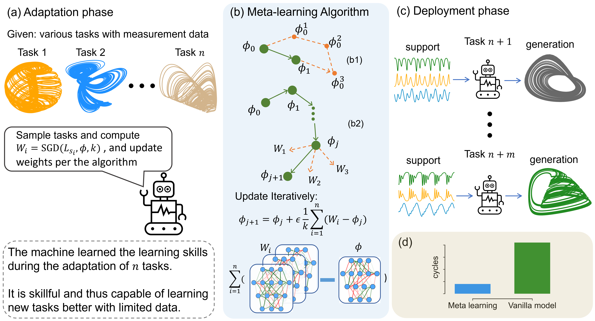

<h1 align="center">Learning to learn ecosystems from limited data - a meta-learning approach</h1>

<p align="center">

</p>

Paper entitled ''Learning to learn ecosystems from limited data - a meta-learning approach'', submitted to PRX Life, under review. You can find it from [ArXiv](https://arxiv.org/abs/2410.07368).

Leveraging synthetic data from paradigmatic nonlinear but non-ecological dynamical systems, we develop a meta-learning framework with time-delayed feedforward neural networks to predict the long-term behaviors of ecological systems as characterized by their attractors. We show that the framework is capable of accurately reconstructing the ''dynamical climate'' of the ecological system with limited data. Two real-world ecological benchmarks are used to test the framework.

# Simulation guidance

Download the time series data of all chaotic systems from [Zenodo](https://zenodo.org/records/14261464) and move them to the 'data' folder. You can also generate the chaotic data by running `save_chaos.py` required for the machine learning code that follows. To proceed with the machine learning code, either download the data and move it to the 'chaos_data' folder or generate the data yourself.

Run `reptile_main.py` to train the model and evaluate it on target ecological systems. An example of predicting chaotic foodchain system is shown below: 


# Cite our work
```
@article{zhai2024learning,
  title={Learning to learn ecosystems from limited data--a meta-learning approach},
  author={Zhai, Zheng-Meng and Glaz, Bryan and Haile, Mulugeta and Lai, Ying-Cheng},
  journal={arXiv preprint arXiv:2410.07368},
  year={2024}
}
```


