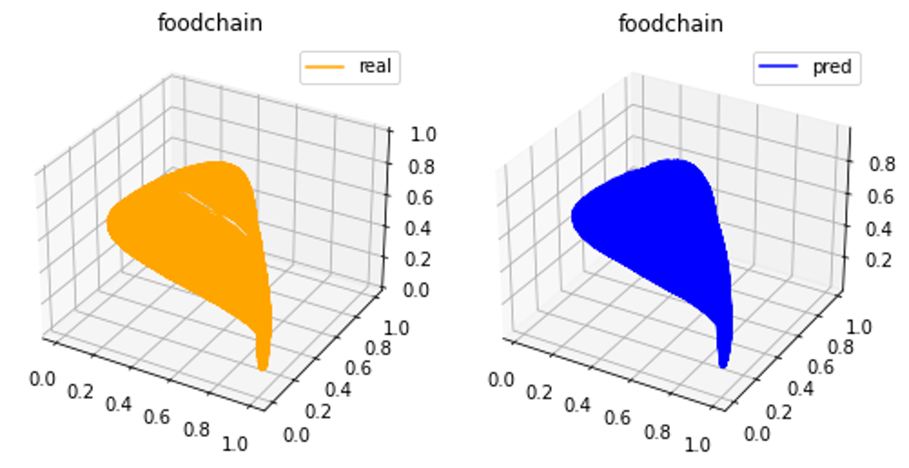
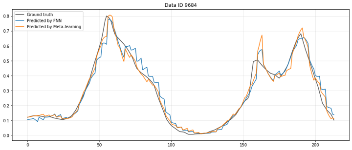

<h1 align="center">Learning to learn ecosystems from limited data - a meta-learning approach</h1>

<p align="center">

</p>

Paper entitled ''Learning to learn ecosystems from limited data - a meta-learning approach'', submitted to PRX Life, under review. You can find it from [ArXiv](https://arxiv.org/abs/2410.07368).

Leveraging synthetic data from paradigmatic nonlinear but non-ecological dynamical systems, we develop a meta-learning framework with time-delayed feedforward neural networks to predict the long-term behaviors of ecological systems as characterized by their attractors. We show that the framework is capable of accurately reconstructing the ''dynamical climate'' of the ecological system with limited data. Two real-world ecological benchmarks are used to test the framework.

# Simulation guidance

Download the time series data of all chaotic systems from [Zenodo](https://zenodo.org/records/14261464) and place them in the 'data' folder. Alternatively, you can generate the chaotic data by running `save_chaos.py`. To proceed with the machine learning code, ensure the chaotic data is available in the 'data' folder, either by downloading it or generating it yourself.

Run `reptile_main.py` to train the model and evaluate its performance on target ecological systems. Below is an example of a chaotic food chain system prediction using meta-learning:

<p align="center">

</p>

To apply the model to real-world data, first download the data and move it to the 'data_real' folder. An example dataset, 'long_series.pkl', is provided and includes time series exceeding 100 points, sourced from [Global Population Dynamics Database](https://knb.ecoinformatics.org/view/doi:10.5063/F1BZ63Z8).

Run `compare_real.py` to simulate and compare the performance of the meta-learning model with a vanilla model on the same task. An example is shown below:

<p align="center">

</p>

The MSE for one- to four-step predeictions are [0.00062, 0.0014, 0.0025, 0.0039] and [0.00040, 0.0009, 0.0017, 0.0027] for the FNN and Meta-learning, respectively.

# Cite our work
```
@article{zhai2024learning,
  title={Learning to learn ecosystems from limited data--a meta-learning approach},
  author={Zhai, Zheng-Meng and Glaz, Bryan and Haile, Mulugeta and Lai, Ying-Cheng},
  journal={arXiv preprint arXiv:2410.07368},
  year={2024}
}
```


